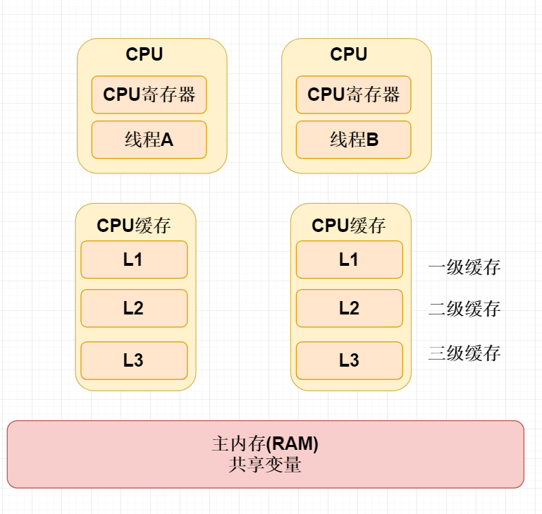

## 多线程 volatile

### 本节内容

1. volatile三大特性
2. 现代计算机CPU多核硬件架构剖析
3. 站在CPU多核角度分析JMM内存模型
4. CPU一致性缓存协议MESI
5. Java内存模型规范JSR133
6. 为什么volatile不能够保证原子性
7. 双重检验锁为什么需要加上volatile
8. JMM中的重排序及内存屏障
9. volatile存在的伪共享的问题

 

#### 什么是 Volatile

能够保证线程可见性，当一个线程修改共享变量时，能够保证对另外一个线程可见性，但是注意他不能够保证共享变量的原子性问题。

 

#### Volatile的特性

**可见性**

能够保证线程可见性，当一个线程修改共享变量时，能够保证对另外一个线程可见性，但是注意他不能够保证共享变量的原子性问题。

**顺序性**

程序执行程序按照代码的先后顺序执行。

**原子性**

即一个操作或者多个操作要么全部执行并且执行的过程，要么失败。

 

#### CPU多核硬件架构剖析

CPU每次从主内存读取数据比较慢，而现代的CPU通常涉及多级缓存，CPU读主内存。按照空间局部性原则加载，局部快到缓存中。

 

#### 为什么会产生可见性的原因

因为我们CPU读取主内存共享变量的数据时候，效率是非常低，所以对每个CPU设置对应的高速缓存 L1、L2、L3  缓存我们共享变量主内存中的副本。

相当于每个CPU对应共享变量的副本，副本与副本之间可能会存在一个数据不一致性的问题。

比如线程线程B修改的某个副本值，线程A的副本可能不可见。导致可见性问题。

L1、L2属于每个CPU中多利的缓存

L3属于多个CPU之间共享的缓存

**图一：**

 

**图二：**

每个CPU之间都有独立的二级缓存缓存主内存的数据作为副本，而副本与副本之间是完成不共享的