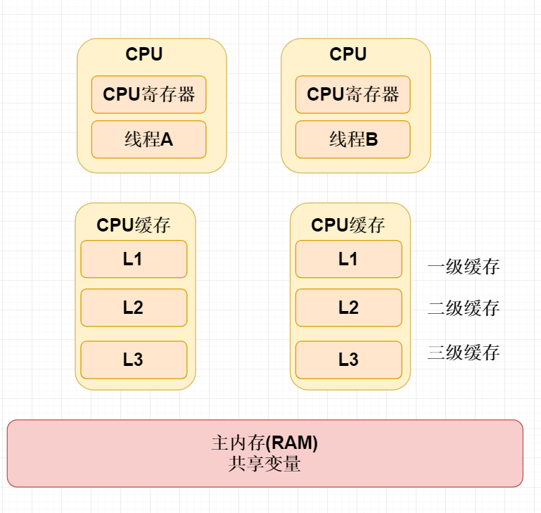
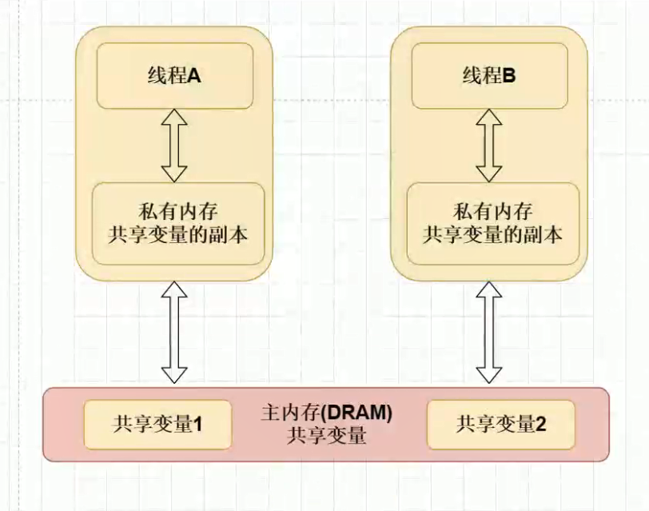
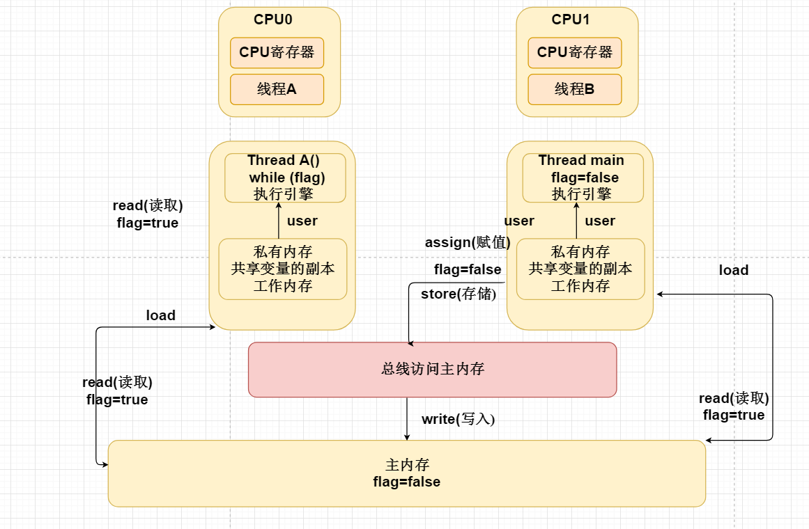

## 多线程 volatile

### 本节内容

1. volatile三大特性
2. 现代计算机CPU多核硬件架构剖析
3. 站在CPU多核角度分析JMM内存模型
4. CPU一致性缓存协议MESI
5. Java内存模型规范JSR133
6. 为什么volatile不能够保证原子性
7. 双重检验锁为什么需要加上volatile
8. JMM中的重排序及内存屏障
9. volatile存在的伪共享的问题
10. 多核cpu中为何Volatile伪共享问题
11. 站在JMM底层分析为什么Volatile不能保证原子性
12. 如何理解CPU缓存行读取存在性能问题
13. 如何避免CPU存在的为共享问题
14. 多线程情况下Volatile重排序后，可能存在的问题
15. 单例中双重检验锁为什么需要加上volatile
16. synchronized 与volatile存在的区别

 

#### 什么是 Volatile

能够保证线程可见性，当一个线程修改共享变量时，能够保证对另外一个线程可见性，但是注意他不能够保证共享变量的原子性问题。

 

#### Volatile的特性

**可见性**

能够保证线程可见性，当一个线程修改共享变量时，能够保证对另外一个线程可见性，但是注意他不能够保证共享变量的原子性问题。

**顺序性**

程序执行程序按照代码的先后顺序执行。

**原子性**

即一个操作或者多个操作要么全部执行并且执行的过程，要么失败。

 

#### CPU多核硬件架构剖析

CPU每次从主内存读取数据比较慢，而现代的CPU通常涉及多级缓存，CPU读主内存。按照空间局部性原则加载，局部快到缓存中。

 

#### 为什么会产生可见性的原因

因为我们CPU读取主内存共享变量的数据时候，效率是非常低，所以对每个CPU设置对应的高速缓存 L1、L2、L3  缓存我们共享变量主内存中的副本。

相当于每个CPU对应共享变量的副本，副本与副本之间可能会存在一个数据不一致性的问题。

比如线程线程B修改的某个副本值，线程A的副本可能不可见。导致可见性问题。

L1、L2属于每个CPU中多利的缓存

L3属于多个CPU之间共享的缓存

**图一：**

 

**图二：**

每个CPU之间都有独立的二级缓存缓存主内存的数据作为副本，而副本与副本之间是完成不共享的

 

#### JMM内存模型

Java内存模型定义的是一种抽象的概念，定义屏蔽java程序对不同的操作系统的内存访问差异。

> 误区：Java 内存模型与 Java 内存结构 就是 jmm 和 Java 内存结构

主内存：

存放我们共享变量的数据

 

什么时工作内存：

指的其实就是我们主内存共享变量数据的副本。

每个CPU对共享变量（主内存）的副本。堆+方法区

 

#### JMM八大同步规范

 

1. lock(锁定)：作用于 主内存的变量，把一个变量标记为一条线程独占状态
2. unlock(解锁)：作用于 主内存的变量，把一个处于锁定状态的变量释放出来，释放后的变量才可以被其他线程锁定
3. read(读取)：作用于 主内存的变量，把一个变量值从主内存传输到线程的 工作内存中，以便随后的load动作使用
4. load(载入)：作用于 工作内存的变量，它把read操作从主内存中得到的变量值放入工作内存的变量副本中
5. use(使用)：作用于 工作内存的变量，把工作内存中的一个变量值传递给执行引擎
6. assign(赋值)：作用于 工作内存的变量，它把一个从执行引擎接收到的值赋给工作内存的变量
7. store(存储)：作用于 工作内存的变量，把工作内存中的一个变量的值传送到 主内存中，以便随后的write的操作
8. write(写入)：作用于 工作内存的变量，它把store操作从工作内存中的一个变量的值传送到 主内存的变量中

 

#### Volatile的底层实现原理

1. 通过汇编lock前缀指令触发底层锁的机制
2. 锁的机制两种：总线锁/MESI缓存一致性协议

主要帮助我们解决多个不同cpu之间三级缓存之间数据同步

 

#### 总线锁

当一个cpu（线程）访问到我们主内存中的数据时候，往总线总发出一个Lock锁的信号，其他的线程不能够对该主内存做任何操作，变为阻塞状态。该模式，存在非常大的缺陷，就是将并行的程序，变为串行，没有真正发挥出cpu多核的好处。

 

#### MESI协议

1 .M 修改 (Modified) 这行数据有效，数据被修改了，和主内存中的数据不一致，数据只存在于本Cache中。
2. E 独享、互斥 (Exclusive) 这行数据有效，数据和主内存中的数据一致，数据只存在于本Cache中。
3. S 共享 (Shared) 这行数据有效，数据和主内存中的数据一致，数据存在于很多Cache中。
4. I 无效 (Invalid) 这行数据无效。

 

E：独享：当只有一个cpu线程的情况下，cpu副本数据与主内存数据如果保持一致的情况下，则该cpu状态为E状态 独享。
S：共享：在多个cpu线程的情况了下，每个cpu副本之间数据如果保持一致的情况下，则当前cpu状态为S
M:如果当前cpu副本数据如果与主内存中的数据不一致的情况下，则当前cpu状态为M
I: 总线嗅探机制发现 状态为m的情况下，则会将该cpu改为i状态无效，该cpu缓存主动获取主内存的数据同步更新。

总线：维护解决cpu高速缓存副本数据之间一致性问题。

如果状态是M的情况下，则使用嗅探机制通知其他的CPU工作内存副本状态为I无效状态，则 刷新主内存数据到本地中，从而多核cpu数据的一致性。
